<div align="center">

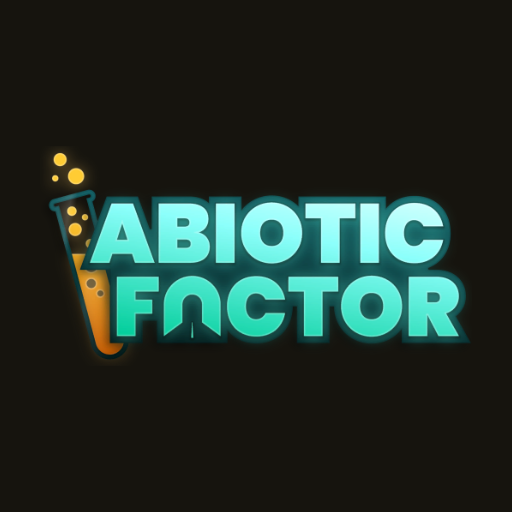

# Abiotic Editor

**A save-game editor for [Abiotic Factor](https://store.steampowered.com/app/427410/Abiotic_Factor/).**

Open your save, change almost anything (your stats, inventory, skills, recipes, quest
progress, even the whole world), and play on. No hex editors, no spreadsheets, no risk to
your originals.

[Download](https://github.com/ChristopherVR/AbioticEditor/releases/latest) ·
[Documentation](https://christophervr.github.io/AbioticEditor/) ·
[Getting started](https://christophervr.github.io/AbioticEditor/guide/getting-started)

</div>

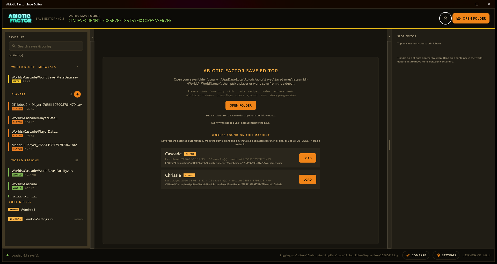

---

## What is this?

Abiotic Factor stores your progress in `.sav` files on disk. Abiotic Editor reads those
files, shows you what's inside as friendly, clickable controls (sliders for your needs,
a grid for your inventory, a checklist for recipes), and writes your changes back so the
game picks them up next time you load.

It's a **fan-made tool**, not part of the game. Think of it as a cheat menu, a save repair
kit, and a save inspector rolled into one. It's handy if you want to:

- 🧪 **Tweak a single-player run**: top up your needs, max a skill, give yourself money,
  unlock a recipe, or hand yourself an item you're missing.
- 🛠️ **Run or fix a dedicated server**: edit any player's save, adjust world state, change
  difficulty in `SandboxSettings.ini`, or move a save to a new Steam account.
- ↩️ **Undo a mistake**: recover from a bad decision, un-kill an NPC, refill a harvested
  node, or compare a broken save against a backup to see exactly what changed.
- 🔍 **Just look**: see what the game actually records, with every value labelled.

If you've never edited a save before, start with the
**[Getting started guide](https://christophervr.github.io/AbioticEditor/guide/getting-started)**.

## How it works (the short version)

1. **Point it at your save folder.** The editor scans it and lists every player save, every
   world region, the story/metadata save, and any server config files in a sidebar.
2. **Pick a save and edit it.** Player saves open a player editor (vitals, inventory, skills,
   traits, recipes, journal, appearance, spawn point, and more). World saves open a world
   editor (containers, quest flags, doors, dropped items, NPCs, bases, story progression).
3. **Press SAVE.** Nothing is written until you do. **Every save automatically keeps a `.bak`
   copy** of the previous file next to it, so you can always go back.

The editor reads and writes the game's real save format *byte-for-byte*: anything it
doesn't touch is left exactly as the game wrote it. It also reads the game's own data tables
(the names and icons of every item, recipe, skill, and quest) straight from your installed
copy of the game, so what you see matches what's in-game.

> **Is it safe?** Edits are staged until you hit SAVE, every write keeps a `.bak`, and the
> editor refuses to create impossible states (for example, it offers to set a quest's
> prerequisites rather than let you skip ahead into a broken story). That said, it's a
> save editor. Keep your own backups of saves you care about.

## A quick tour

### Your character

The **player editor** opens on your vitals (hunger, thirst, sanity, fatigue, body health,
and money) as sliders you can drag or type into.

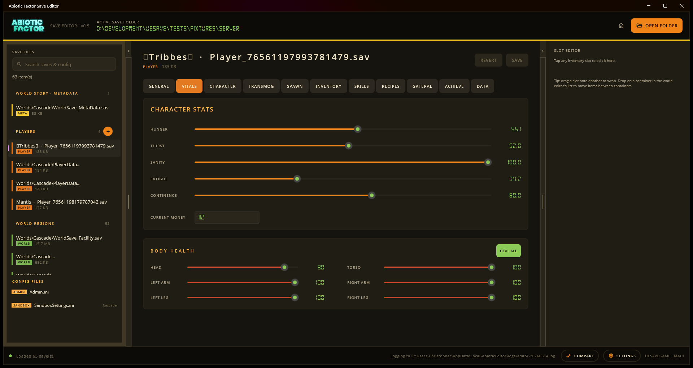

**Inventory** shows every slot (backpack, pockets, equipment, even a deployed backpack's
contents) with the real in-game icons. Click a slot to change the item, its quantity, or
its durability; drag one slot onto another to swap. A searchable item catalogue on the right
lets you drop in anything from the game.

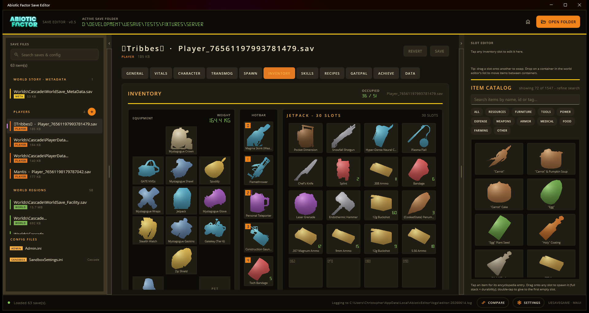

**Skills** lists all fifteen skills with their level, XP, and milestone perks. Nudge a level,
set the XP, or MAX everything. (Perks you haven't unlocked yet stay sealed, to avoid
spoilers; more on that below.)

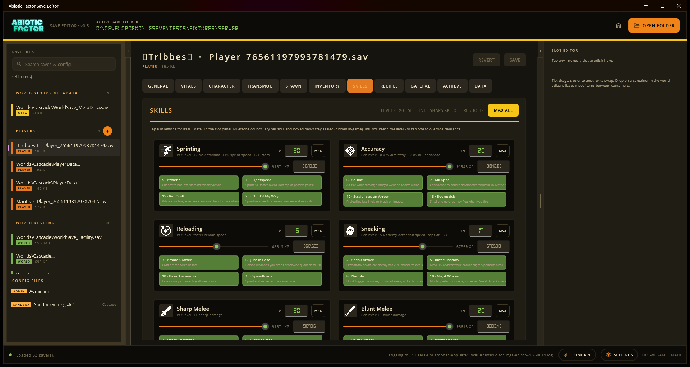

**Recipes** is your full crafting book: search it, filter by category, and tick recipes
on or off, or UNLOCK ALL at once.

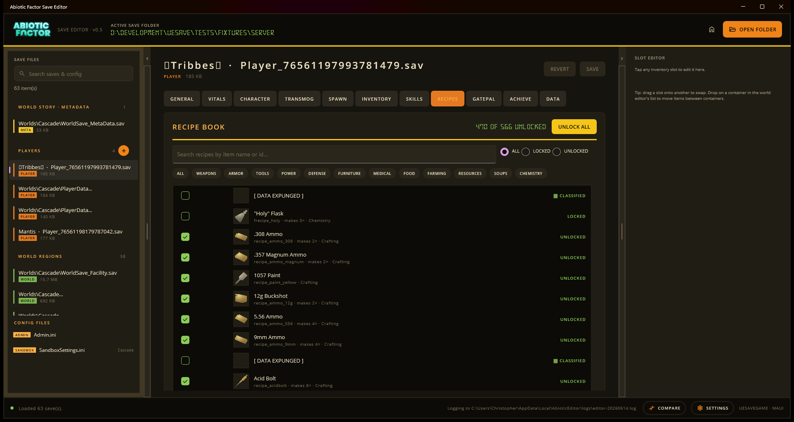

**Character** covers your background (job), traits (add or remove any of them, with their
point values and descriptions), and appearance.

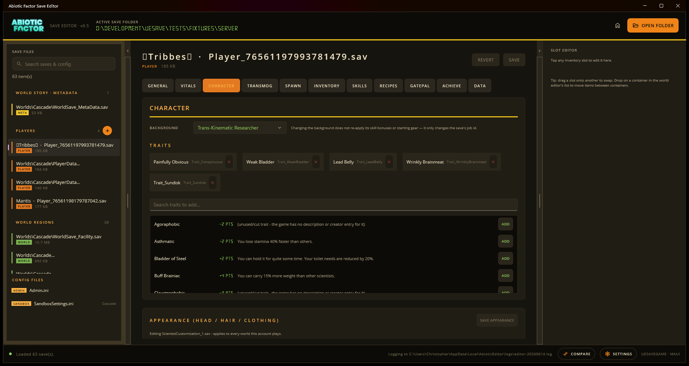

**GatePal** is your in-game journal: read or unread e-mails, notes, the creature/item
compendium, and the fish journal with catch requirements.

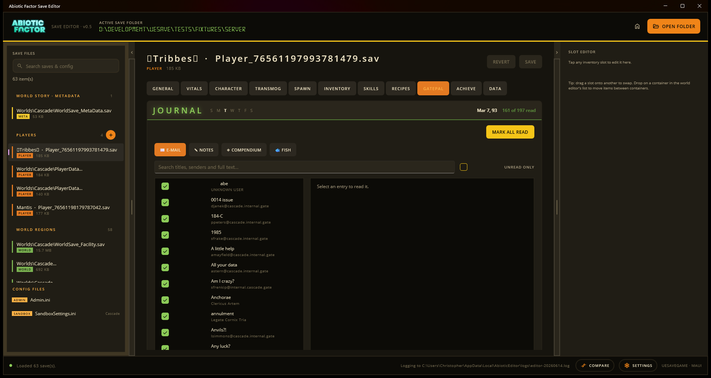

There's more besides: **Transmog** (armour appearance), **Spawn** (your respawn point and
teleporter tags), and **Achievements**.

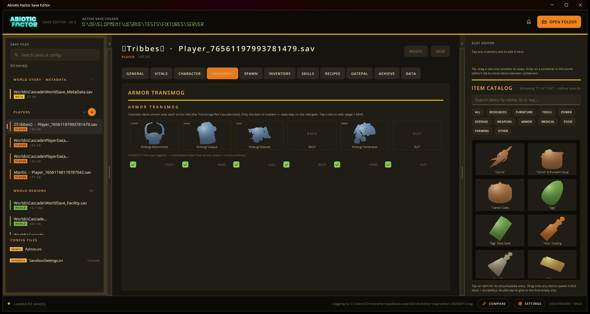

### The world

World saves open the **world editor**. The header shows the world day and time of day, and
tabs break the world down into the things you can change.

**Quest flags** are the one-way switches the game flips as the story advances. The editor
groups them by story chapter, explains how the quest chain works, and lets you set or clear
any flag, setting the prerequisites for you so you never end up in an impossible state.

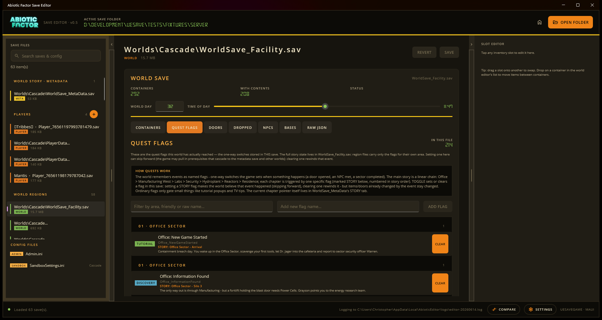

**Containers** lists every storage object in the region and what's inside it. **NPCs** shows
story characters and your tamed pets: revive a dead one, rename a pet, or nudge a story
character's state.

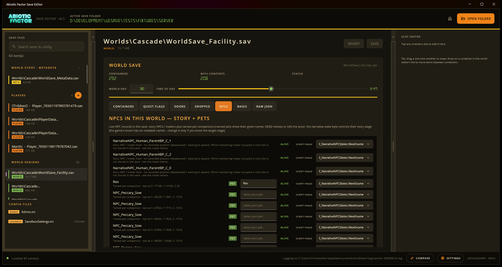

You can also edit **doors** (locked/open state), **dropped items** on the ground, and
**bases**, and there's always a raw JSON view for anything the UI doesn't cover.

### Server config

If you point the editor at a dedicated-server folder, it also finds `Admin.ini` and each
world's `SandboxSettings.ini` and gives you a key/value editor for them: adjust difficulty,
XP rates, stack sizes, spawn rates, and the rest, no text editing required.

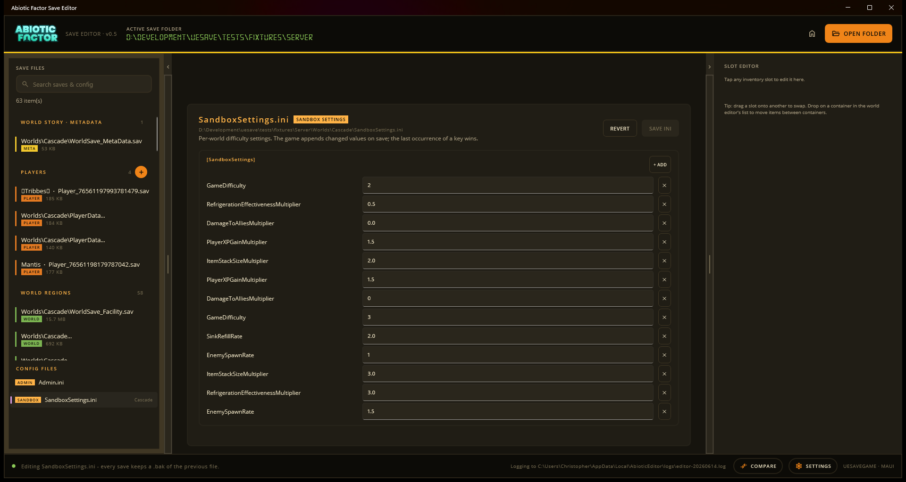

### Settings, spoilers, and comparing saves

**Settings** lets you switch the theme, turn on diagnostic logging, import a newer game data
file after an update, manage plugins, and toggle **spoiler protection**, which seals
content you haven't reached yet (future quests, recipes, hidden achievements, codex entries)
behind a `CLASSIFIED` stamp until you choose to reveal it.

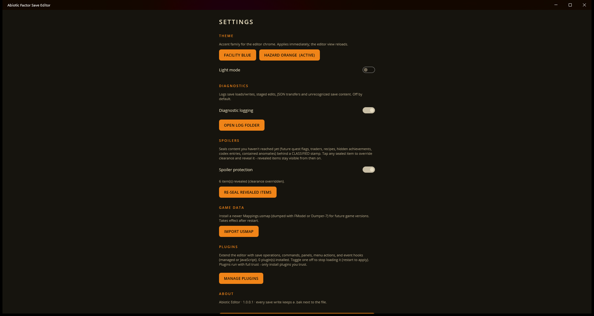

**Compare** diffs two saves (or a save against one of its backups) and lists every
difference, so you can see exactly what changed between two points in time.

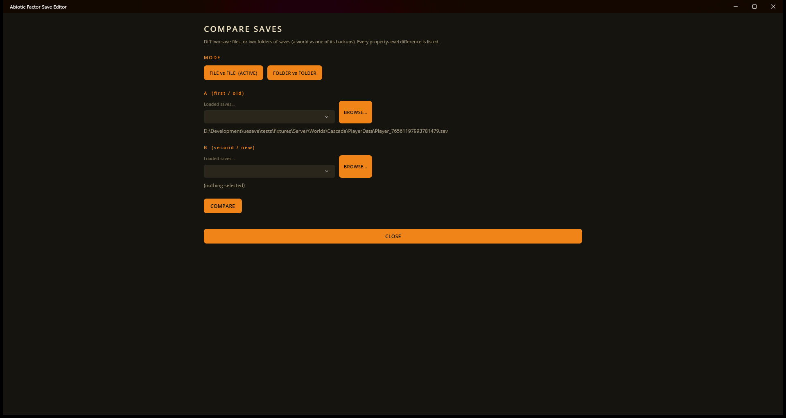

---

## Install

Grab the latest build for your platform from the
[**Releases page**](https://github.com/ChristopherVR/AbioticEditor/releases/latest), unzip,
and run. Both the app and the CLI self-update from there (the app from **Settings ▸ Updates**,
the CLI via `abioticeditor update`).

| Download | What it is |
|---|---|
| `AbioticEditor-app-win-x64.zip` | Desktop app (Windows) |
| `AbioticEditor-app-osx-x64.zip` / `-osx-arm64.zip` | Desktop app (macOS, unsigned) |
| `AbioticEditor-cli-win-x64.zip` | Command-line tool (Windows) |
| `AbioticEditor-cli-linux-x64.zip` | Command-line tool (Linux) |
| `AbioticEditor-cli-osx-x64.zip` / `-osx-arm64.zip` | Command-line tool (macOS) |

> macOS builds are unsigned, so Gatekeeper warns on first launch; right-click the app and
> choose **Open** to run it.

### Where are my saves?

- **Game client:** `%LOCALAPPDATA%\AbioticFactor\Saved\SaveGames\<steamid>\Worlds\<WorldName>`
- **Dedicated server:** the folder that contains `Worlds\<WorldName>`.

The editor also detects client and server save folders on your machine automatically and
lists them on the welcome screen, so you can usually just click **LOAD** instead of browsing.

## The command-line tool

Everything the app does to a save, it does through a shared engine, and that same engine
ships as a headless CLI (`abioticeditor`) for scripting and server administration. It writes
**byte-identical output** to the app. Run `abioticeditor --help` for the full list.

```console
abioticeditor scan <folder>                      # list saves with kind and version
abioticeditor info <save.sav>                    # key facts about one save
abioticeditor export-json <save.sav> -o out.json # lossless JSON dump
abioticeditor import-json <save.sav> in.json     # rebuild the save from JSON
abioticeditor flags list <world.sav>             # quest flags (--filter to narrow)
abioticeditor flags set  <world.sav> <flag>      # set a flag (--clear, --force)
abioticeditor world list <world.sav>             # editable world-state maps in a save
abioticeditor compare <a> <b>                    # diff two saves or two folders
abioticeditor steamid <player.sav> <newid64>     # reassign the owning Steam account
abioticeditor ini get/set <file.ini> ...         # read or edit a server ini value
abioticeditor version                            # tool + supported save versions
```

Exit codes: `0` success, `1` usage or data error, `2` unexpected failure. `--json` switches
the read commands to machine-readable output. Full reference:
**[Command-line tool](https://christophervr.github.io/AbioticEditor/guide/cli)**.

## Plugins

The editor is extensible. A **plugin** can add save operations (bulk edits, cheats, repairs),
new CLI verbs, UI panels, menu actions, and event handlers, as a compiled **.NET assembly**
(`.dll`) or a plain **JavaScript file** (`.js`, no build step). Plugins run with full trust,
so only install ones you trust.

```console
abioticeditor plugins list                       # installed plugins + capabilities
abioticeditor plugins run <operation> <save>     # run a save operation (keeps a .bak)
```

Sample plugins live under [`plugins/`](plugins/). See the
**[plugin system](https://christophervr.github.io/AbioticEditor/plugins)** and the
**[authoring guide](https://christophervr.github.io/AbioticEditor/plugin-authoring)** for the
architecture, the host API, and the security model.

---

## For developers

### Repository layout

| Path | Contents |
|---|---|
| `src/AbioticEditor.Core` | All parsing and editing logic. The app and CLI are thin front-ends over this. |
| `src/AbioticEditor.App` | .NET MAUI desktop editor. |
| `src/AbioticEditor.Cli` | Headless CLI (`abioticeditor`). |
| `src/AbioticEditor.Plugins.Abstractions` | The public plugin SDK (host-agnostic contracts). |
| `src/AbioticEditor.Updater` | Self-updater (talks to GitHub Releases; in-place replace). |
| `plugins/` | Sample plugins (save ops, a CLI command, UI tools, JavaScript/React). |
| `tests/AbioticEditor.Tests` | Assertion tests over real save fixtures. |
| `tests/AbioticEditor.Probes` | Research probes that dump game data structures (not in the normal test run). |
| `assets/Mappings.usmap` | Bundled type mappings for the validated game build. |
| `submodules/` | Pinned source builds of UeSaveGame and CUE4Parse (see below). |
| `docs/` | The documentation site (VitePress), save-format research notes, and the progress log. |

### Building

Requires the **.NET 10 SDK**. Clone with submodules; the build depends on the pinned
`submodules/` source projects.

```console
git clone --recursive https://github.com/ChristopherVR/AbioticEditor.git
cd AbioticEditor

dotnet build src/AbioticEditor.App -f net10.0-windows10.0.19041.0   # desktop editor (Windows)
dotnet build src/AbioticEditor.Cli                                   # CLI
dotnet test  tests/AbioticEditor.Tests                               # tests
```

The app project also targets Android, iOS, and Mac Catalyst; building those needs the matching
MAUI workloads (`dotnet workload install maui`). Package versions are managed centrally in
`Directory.Packages.props`.

> The `CUE4Parse-Natives … 'cmake' is not recognized` line during a build is **benign**: the
> native texture decoder is optional and managed parsing still works.

### How the editor is structured

**Core is the engine; the app and CLI are thin shells.** All parsing and editing lives in
`src/AbioticEditor.Core`, so the CLI writes byte-identical output to the app and new tooling
can reuse the same code.

**Read → mutate-in-place → re-serialize.** For each save kind a *reader* parses the raw GVAS
tree into a typed model whose `.Raw` property *is* the same underlying save instance; a
*writer* mutates that tree in place and re-serializes it byte-perfect for everything it didn't
touch. Because the game delta-serializes (any property still at its blueprint default is
omitted from the file), readers match properties by prefix and writers re-create a missing
property using its exact full name.

**Game data comes from the installed game's paks.** Item/recipe/skill/flag/fish/trait
catalogs are read from the game's pak archives via CUE4Parse plus the bundled
`Mappings.usmap`. **Everything degrades gracefully when the game isn't installed**: catalogs
come back empty and icons are skipped, so the editor still opens and edits saves.

### Keeping the game build in sync (usmap)

Reading the game's data tables needs a `Mappings.usmap` matching the installed build. A
validated one is bundled. When the game updates, dump a fresh usmap with
[Dumper-7](https://github.com/Encryqed/Dumper-7) or [FModel](https://fmodel.app/) and install
it via the status bar **IMPORT USMAP** button, or copy it to
`%LOCALAPPDATA%\AbioticEditor\mappings\Mappings.usmap` (the user-installed file always wins).
Without a matching usmap the editor still opens and edits saves; only asset-backed features
degrade.

### Version compatibility

Save headers carry an `ABF_SAVE_VERSION`; the versions this build was validated against live
in `SaveVersionRegistry` and are shown by `abioticeditor version`. Saves from a newer game
build still open: unknown quest flags, skills, recipes, and enum values round-trip
byte-identical and are preserved untouched, and new data-table content (backpacks, teleporter
tags, keypad-hacker tiers) is picked up at runtime. The editor shows a compatibility report
when it sees content it doesn't recognise.

### Why submodules instead of NuGet?

`submodules/UeSaveGame` does the GVAS (de)serialization and `submodules/CUE4Parse` reads the
game's pak archives. Both are pinned as source submodules because the editor depends on exact
serialization behaviour (a save must round-trip byte-identical) and needs to be debuggable
into both when the game changes formats. There's no good NuGet alternative either: CUE4Parse's
package is tagged rarely and lags `master` by ~840 commits / over a year, and UeSaveGame isn't
on NuGet at all. Clone with `--recursive`, or run `git submodule update --init` after a plain
clone.

### Documentation

The docs site is a [VitePress](https://vitepress.dev/) project under `docs/`, published to
GitHub Pages. To work on it:

```console
cd docs
npm install
npm run docs:dev        # local preview with hot reload
npm run docs:build      # production build
```

The deeper save-format research notes and the running session log (`docs/PROGRESS.md`) also
live there.

---

<div align="center">
<sub>A fan-made tool. Not affiliated with or endorsed by the developers of Abiotic Factor.</sub>
</div>
