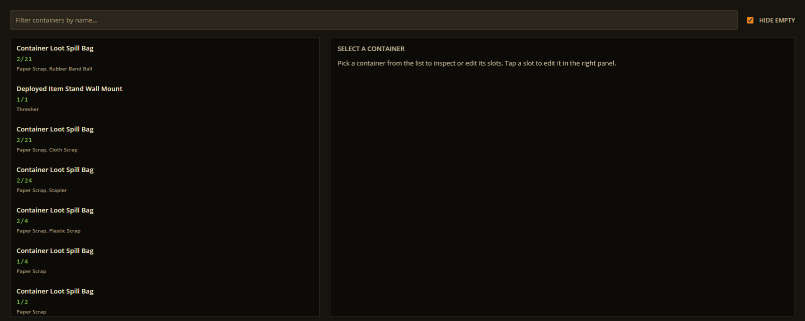

# Abiotic Editor

### GATE field kit for the saves you care about

Repair a world. Repack a backpack. Bring a lost friend home. Abiotic Editor is a fan-made save editor for **Abiotic Factor** that works on your own computer.

[🧪 Open the browser editor](https://christophervr.github.io/AbioticEditor/app/) · [📦 Download the desktop app](https://github.com/ChristopherVR/AbioticEditor/releases/latest) · [📖 Read the player guide](https://christophervr.github.io/AbioticEditor/guide/getting-started)

> **FIELD NOTE:** Make a copy of your save before an expedition. The desktop app makes a `.bak` copy when it saves, but your own spare copy is the safest way to experiment.

## Pick your route

| Route | Choose it when | Start here |
| --- | --- | --- |
| **Browser editor** | You want a quick edit with no install. | [Open it in your browser](https://christophervr.github.io/AbioticEditor/app/) |
| **Desktop app** | You play on Windows, Linux, or Steam Deck and want save discovery, transfers, Game Pass tools, and more. | [Download the latest release](https://github.com/ChristopherVR/AbioticEditor/releases/latest) |
| **Live editing** | You are comfortable with an experimental tool (Windows, or Linux through Steam Play) that changes a running game. | [Read the live-editing briefing](https://christophervr.github.io/AbioticEditor/guide/live-editing) |

The browser editor works entirely in your browser. The desktop app works locally too. Your saves are not uploaded to a server.

## Your first save edit

1. **Close Abiotic Factor** or stop the server. Copy your world folder somewhere safe.
2. **Open a world** in the editor. On desktop, it can usually find your saves for you.
3. **Choose a player or world file**, make the change, then select **SAVE**.
4. In the browser, select **EXPORT** too if it asks you to download the changed save or zip.
5. Start the game and check the result before changing anything else.

[Follow the full getting-started guide](https://christophervr.github.io/AbioticEditor/guide/getting-started) for save locations, downloads, and the small differences between platforms.

## What is in the kit?

### Your character

Restore health and needs, organise inventory and equipment, adjust skills and recipes, revisit appearance choices, and manage GatePal entries. Steam achievements are shown for reference only.

### Your facility

Search containers, recover dropped items, manage pets and NPCs, repair resource nodes, work with doors and vehicles, and inspect story progress. Quest changes offer prerequisite help because the Facility remembers more than one step at a time.

### Recovery tools

Compare two saves, move items between worlds, repair Game Pass save containers, adjust server settings, and inspect a save when something looks wrong.

## Common missions

| I need to... | Guide |
| --- | --- |
| Open a save from a folder or zip in a browser | [Browser editor](https://christophervr.github.io/AbioticEditor/guide/browser-editor) |
| Set up the desktop app on Linux or Steam Deck | [Linux and Steam Deck](https://christophervr.github.io/AbioticEditor/guide/linux-local-host) |
| Move supplies or a character inventory to another world | [Transfer items](https://christophervr.github.io/AbioticEditor/guide/transfer-items) |
| Work safely with Xbox / Game Pass saves | [Game Pass guide](https://christophervr.github.io/AbioticEditor/guide/game-pass) |
| Find out why an item name or icon is missing | [Game data guide](https://christophervr.github.io/AbioticEditor/guide/game-data) |
| Add a community tool or language pack | [Plugins and language packs](https://christophervr.github.io/AbioticEditor/guide/plugins) |

## Before you press save

Save editing is powerful, and the game may not enjoy every possible combination of story flags, items, or modded content. Change one thing at a time, keep a copy of the original, and test in game. The editor keeps ordinary file edits staged until you select **SAVE**.

Live editing is different: it is experimental, changes the running game immediately, has fewer features, and has no editor backup or universal undo. It needs UE4SS, a separate open-source mod loader; the Windows release (and the Linux release, for a game running through Steam Play/Proton) now includes a pinned copy and installs it into your game folder with your permission (an existing UE4SS install is left alone). [Use the live-editing guide](https://christophervr.github.io/AbioticEditor/guide/live-editing) before setting it up.

## Need help?

Start with the [player documentation](https://christophervr.github.io/AbioticEditor/guide/). If something fails, turn on **Settings > Diagnostics**, reproduce the problem, then use **OPEN LOG FOLDER**. Please include your editor version, platform, where the save came from, and what happened in a [GitHub issue](https://github.com/ChristopherVR/AbioticEditor/issues/new/choose) or a [Nexus Mods post](https://www.nexusmods.com/abioticfactor/mods/244?tab=posts).

## For modders and server admins

The command line, plugin SDK, save-format notes, and build instructions live in the [technical reference](https://christophervr.github.io/AbioticEditor/reference/). Start with the [CLI guide](https://christophervr.github.io/AbioticEditor/guide/cli), [plugin authoring guide](https://christophervr.github.io/AbioticEditor/reference/plugin-authoring), or [architecture notes](docs/reference/architecture.md).

## Credits and licence

Abiotic Editor is not affiliated with or endorsed by the developers of Abiotic Factor. It is released under the [Apache License 2.0](LICENSE). Wiki reference images are credited to [abioticfactor.wiki.gg](https://abioticfactor.wiki.gg) under CC BY-NC-SA.

See the [screenshot tour](https://christophervr.github.io/AbioticEditor/guide/screenshots) for player, world, settings and live-setup screens.
