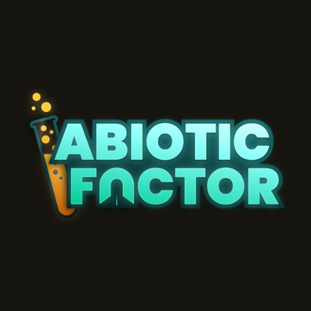
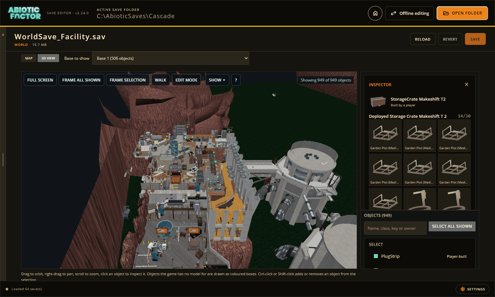
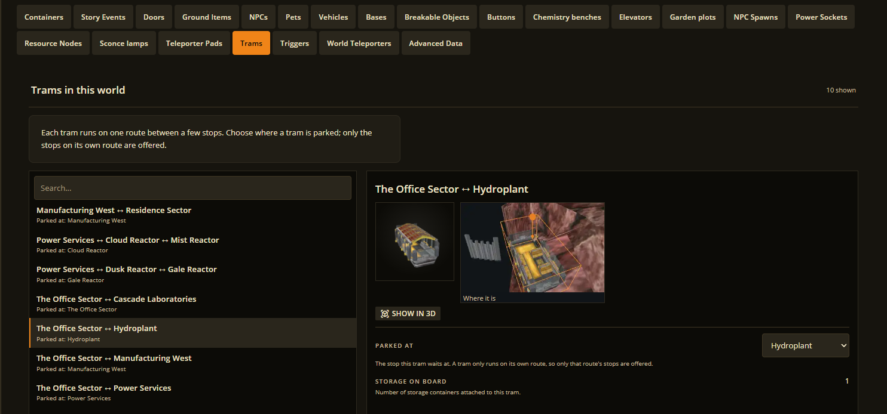
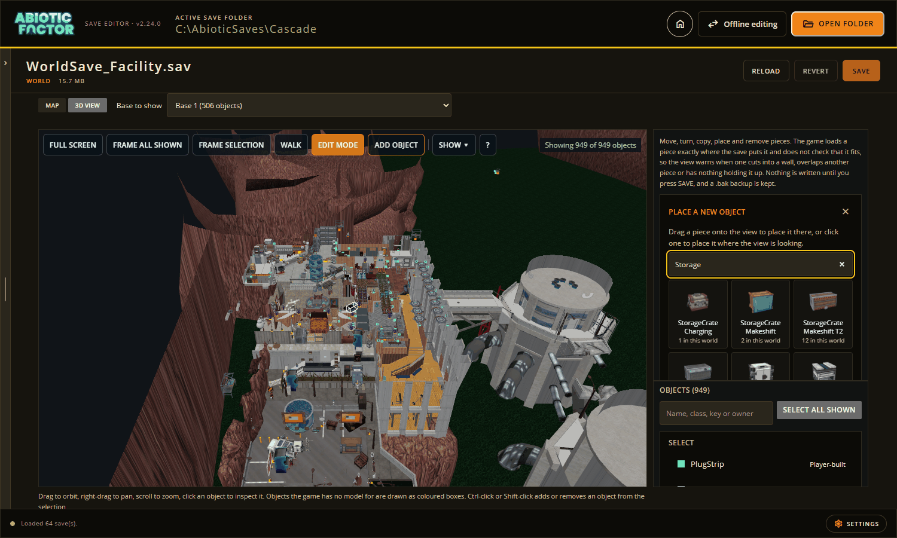

# Abiotic Editor

### GATE field kit for the saves you care about

Repair a world. Repack a backpack. Rearrange your base in 3D. Abiotic Editor is a fan-made save editor for **Abiotic Factor** that runs on your own computer.

[📦 Download the desktop app](https://github.com/ChristopherVR/AbioticEditor/releases/latest) · [🧪 Open the browser editor](https://christophervr.github.io/AbioticEditor/app/) · [📖 Read the player guide](https://christophervr.github.io/AbioticEditor/guide/)

> **FIELD NOTE:** Every edit waits until you press **SAVE**, and the editor keeps the old file as a `.bak` copy. Your own spare copy of the world is still the safest way to experiment.

## What can it do?

**Your character.** Restore health and needs, organise inventory and equipment, set skills and recipes, change traits, looks and transmog, move your respawn point, and manage GatePal entries and carried pets.

**Your world.** Restock containers, open doors, recover dropped items, revive story characters, look after pets, fix vehicles, set story progress, unlock traders, fill containment cells, and tend garden plots and chemistry benches. The world lists show a picture of each thing and where it stands.

**Your base, in 3D.** See your base drawn with the game's own models and the level around it. Walk through it, move and copy pieces, place new ones from a picture palette, and wire up power. **Show in 3D** on any list takes you straight to that door, crate or trader.

**Repairs and moves.** Compare two saves, move items between worlds, convert between Steam and Game Pass, repair Game Pass saves, and adjust dedicated-server settings.

**Live editing.** Change a world while the game is running, through a small helper the editor installs for you.

## Pick your route

| Route | Choose it when | Start here |
| --- | --- | --- |
| **Desktop app** | You want everything: save discovery, the 3D view, transfers, Game Pass and live editing. Windows, Linux, Steam Deck and macOS. | [Download the latest release](https://github.com/ChristopherVR/AbioticEditor/releases/latest) |
| **Browser editor** | You want a quick edit with nothing to install. | [Open it in your browser](https://christophervr.github.io/AbioticEditor/app/) |
| **Live editing** | You want to change a running game (Windows, or Linux through Steam Play). | [Read the live editing guide](https://christophervr.github.io/AbioticEditor/guide/live-editing) |

Your saves stay on your computer. Nothing is uploaded, and nothing from the game is in the download: names, pictures and 3D models are read from your own installed copy of Abiotic Factor.

## Your first save edit

1. **Close Abiotic Factor** or stop the server. Copy your world folder somewhere safe.
2. **Start the editor** and choose **Open offline editor**. The desktop app usually finds your worlds for you.
3. **Choose a player or region**, make the change, then select **SAVE**.
4. In the browser, select **EXPORT** too if it asks you to download the changed save.
5. Start the game and check the result before changing anything else.

The [getting-started guide](https://christophervr.github.io/AbioticEditor/guide/getting-started) covers downloads, save locations and the small differences between platforms.

## The 3D view

The desktop app draws your base with the game's own models, read from your installed game. On first start it offers to **get the 3D view ready**: it reads the whole world once in the background, so every area opens quickly afterwards. It offers again after a game update. The browser editor has the 3D view too, with every piece drawn as a box.

[Read the 3D view guide](https://christophervr.github.io/AbioticEditor/guide/3d-view).

## Common missions

| I need to... | Guide |
| --- | --- |
| Find my way around the app | [Desktop app tour](https://christophervr.github.io/AbioticEditor/guide/desktop-app) |
| See and change my base in 3D | [Bases and the 3D view](https://christophervr.github.io/AbioticEditor/guide/3d-view) |
| Open a save from a folder or zip in a browser | [Browser editor](https://christophervr.github.io/AbioticEditor/guide/browser-editor) |
| Set up the desktop app on Linux or Steam Deck | [Linux and Steam Deck](https://christophervr.github.io/AbioticEditor/guide/linux-local-host) |
| Move supplies to another world | [Transfer items](https://christophervr.github.io/AbioticEditor/guide/transfer-items) |
| Work safely with Xbox / Game Pass saves | [Game Pass guide](https://christophervr.github.io/AbioticEditor/guide/game-pass) |
| Find out why an item name or picture is missing | [Game data guide](https://christophervr.github.io/AbioticEditor/guide/game-data) |
| Add a community tool or language pack | [Plugins and language packs](https://christophervr.github.io/AbioticEditor/guide/plugins) |

## Before you press save

The game may not enjoy every possible mix of story flags, items or modded content. Change one thing at a time, keep a copy of the original, and test in game.

Live editing is different: changes apply to the running game straight away, with no editor backup and no undo. It needs UE4SS, a separate open-source mod loader. The Windows and Linux releases include a copy and install it into your game folder with your permission; an existing UE4SS install is left alone. [Read the live editing guide](https://christophervr.github.io/AbioticEditor/guide/live-editing) before setting it up.

## Need help?

Start with the [player guide](https://christophervr.github.io/AbioticEditor/guide/). If something fails, turn on **Settings ▸ General ▸ Diagnostics**, repeat the problem, then use **OPEN LOG FOLDER**. Include your editor version, platform, where the save came from, and what happened in a [GitHub issue](https://github.com/ChristopherVR/AbioticEditor/issues/new/choose) or a [Nexus Mods post](https://www.nexusmods.com/abioticfactor/mods/244?tab=posts).

## For modders and server admins

The command-line tool, plugin SDK, save-format notes and build instructions live in the [technical reference](https://christophervr.github.io/AbioticEditor/reference/). Start with the [CLI guide](https://christophervr.github.io/AbioticEditor/guide/cli), the [plugin authoring guide](https://christophervr.github.io/AbioticEditor/reference/plugin-authoring), or the [architecture notes](docs/reference/architecture.md).

## Credits and licence

Abiotic Editor is not affiliated with or endorsed by the developers of Abiotic Factor. Item icons and the pictures in the world lists (doors, buttons, trams and so on) are drawn from Abiotic Factor's own art, which belongs to its developers. It is released under the [Apache License 2.0](LICENSE). Wiki reference images are credited to [abioticfactor.wiki.gg](https://abioticfactor.wiki.gg) under CC BY-NC-SA.

See the [screenshot tour](https://christophervr.github.io/AbioticEditor/guide/screenshots) for every player, world, 3D, settings and live-setup screen.
